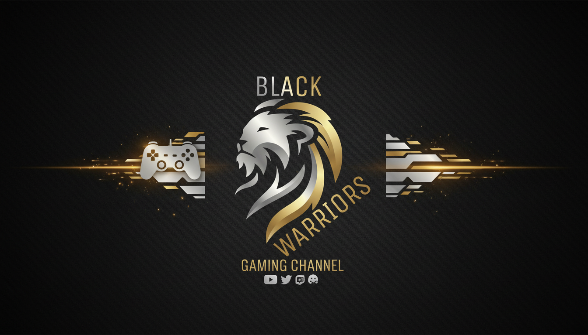

<div align="center">
  

  # 🦁 Black Warriors Esports

  ### **MENA's Premier Free Fire Organization**
  *Dominating the battlefield with precision, strategy, and unmatched teamwork.*

  [](https://nextjs.org/)
  [](https://react.dev/)
  [](https://tailwindcss.com/)
  [](https://www.typescriptlang.org/)

  [Explore the Squad](#-the-elite-squad) • [View Achievements](#-hall-of-fame) • [Join Us](#-recruitment)

</div>

---

## ⚡ Overview

**Black Warriors Esports** is more than just a team; it's a movement toward excellence in competitive gaming. Founded in 2021, we have rapidly ascended to become a dominant force in the MENA Free Fire ecosystem. This platform serves as our digital headquarters, showcasing our legacy, our legends, and our future.

## ✨ Key Features

- 🌍 **International ready**: Full multi-language support (English, French, and Arabic) with RTL support.
- 🎨 **Tactical Aesthetics**: Custom Hero Section with a "Tactical Map" effect, CSS linear-gradients, and pulsing scan lines.
- 📬 **Seamless Recruitment**: Integrated server-side recruitment form powered by **Resend** and **React Email**.
- 🌓 **Dynamic Themes**: Sleek Light/Dark mode transitions with local storage persistence and FOUC prevention.
- 📱 **Fully Responsive**: Optimized for every device, from mobile handsets to high-resolution gaming monitors.
- 🔍 **SEO Optimized**: Advanced metadata, JSON-LD structured data, and dynamic XML sitemaps for Google indexing.

## 🛠️ Tech Stack

- **Framework**: [Next.js 15+](https://nextjs.org/) (App Router & Turbopack)
- **Styling**: [Tailwind CSS](https://tailwindcss.com/) with Custom Design Tokens
- **UI Components**: [Shadcn UI](https://ui.shadcn.com/) (Radix Primitives)
- **Icons**: [Lucide React](https://lucide.dev/)
- **Email Service**: [Resend](https://resend.com/) & [React Email](https://react.email/)
- **Animations**: CSS linear-gradients & Framer Motion (Transitional)
- **Internationalization**: Custom JSON-based Dictionary System

## 🚀 Getting Started

1. **Clone & Install**
   ```bash
   git clone https://github.com/Abdelhamid-elaali/black-warriors-team.git
   cd black-warriors-esports
   npm install
   ```

2. **Environment Setup**
   Create a `.env.local` file with your Resend API Key:
   ```env
   RESEND_API_KEY=re_your_api_key_here
   ```

3. **Development Mode**
   ```bash
   npm run dev
   ```

## 📂 Project Structure

```text
├── app/[lang]      # Page routing & localization logic
├── components/     # Specialized UI components (Header, MapHero, etc.)
├── dictionaries/   # Localization assets (EN, FR, AR)
├── public/         # High-resolution assets & branding
├── styles/         # Global design system & theme variables
└── lib/            # Shared utilities & configurations
```

## 🏆 Hall of Fame
- **Free Fire MENA Cup 2025**: 🥇 Champions
- **Seasonal Kill Record**: 💀 1,247 Eliminations
- **Regional Dominance**: 🌍 #1 Team in Morocco

## 🤝 Contact & Recruitment
Interested in joining the warriors or partnering with us?
- **Email**: recruitment@blackwarriors.gg
- **Discord**: [Join our Community](https://discord.gg/wJs82Mh3G3)

---

<p align="center">
  <b>© 2025 BLACK WARRIORS. ALL RIGHTS RESERVED.</b><br/>
  <i>Made with LBOSS for competitive gaming excellence.</i>
</p>
